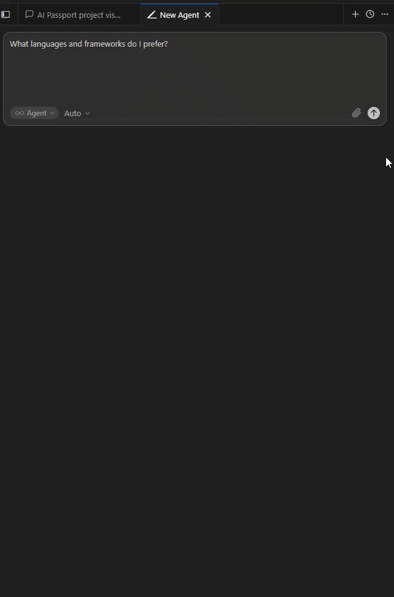

# AI Passport

**One identity. Every AI.**

Portable, user-owned identity for AI systems. You control your data — not OpenAI, not Anthropic, not Cursor.

## Get started

```bash
npm install -g @ai-passport-core/cli
ai-passport onboard cursor --yes
```



*Target: 20–30s with AI response. [Re-record guide](DEMO.html)*

## Documentation

| Document | Description |
|----------|-------------|
| [Open Specification](SPECIFICATION.html) | Public spec index for implementers |
| [Compatibility Checklist](COMPATIBILITY.html) | "Supports AI Passport" criteria |
| [SDK Reference](SDK.html) | `Passport.load()` API |
| [Cursor Setup](CURSOR_SETUP.html) | MCP integration guide |
| [VS Code Setup](VSCODE_SETUP.html) | Generic MCP consumer |
| [API Contract](API.html) | CLI, SDK, MCP tools |
| [Security](SECURITY.html) | Encryption and threat model |
| [RFC Process](RFC.html) | Propose schema changes |
| [RFC Index](rfcs/0001-passport-format.html) | Accepted specifications 0001–0005 |
| [Roadmap](ROADMAP.html) | Project phases |
| [Planning & TODO](PLANNING.html) | SemVer, RFC backlog, active tasks |
| [Demo script](DEMO.html) | 30-second wow moment |
| [Sign in with AI Passport](SIGN_IN.html) | `authorize` + token exchange |
| [Ecosystem](ECOSYSTEM.html) | Phase 5 vision |

## Links

- [npm package](https://www.npmjs.com/package/@ai-passport-core/cli)
- [GitHub repository](https://github.com/Mendocan/ai-passport)
- [JSON Schema](https://github.com/Mendocan/ai-passport/blob/main/schemas/passport.schema.json)
- [Manifesto](MANIFESTO.html)

## Mission

> A user should be recognized by any AI, with explicit permission, without having to start over.
